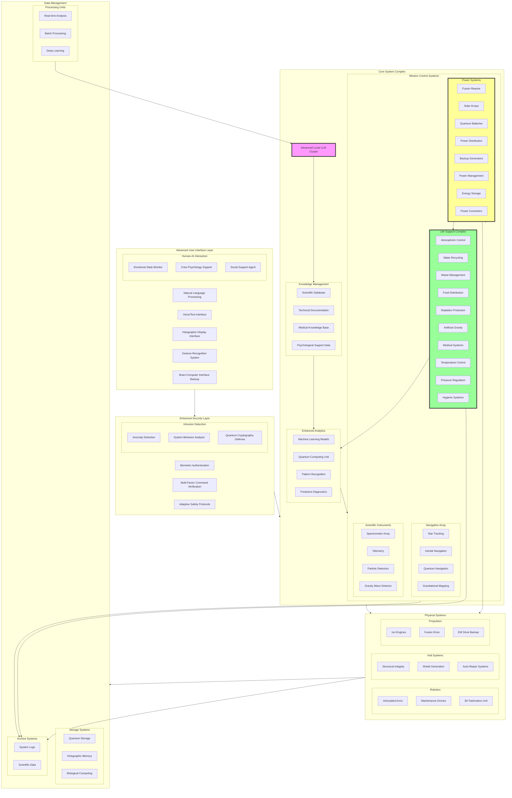

# Comprehensive Spaceship System Architecture

## System Overview
The spaceship system architecture represents a fully integrated and autonomous spacecraft control system built around a core AI-driven management hub. The Advanced User Interface Layer serves as the core of our system which integrates  human-AI interaction through multiple input methods including natural language processing, voice commands, holographic displays, gesture recognition, and a backup brain-computer interface for emergencies. This system also includes Enhanced Security Layer that employs biometric authentication, multi-factor command verification, and adaptive safety protocols to ensure system integrity. The Core System Complex serves as the central nervous system, housing an advanced locally hosted LLM Cluster that manages multiple critical subsystems: the Life Support Complex maintains optimal living conditions through atmospheric control, water recycling, waste management, and medical systems; the Power Systems provide energy through a combination of fusion reactors, solar arrays, and quantum batteries with intelligent power distribution; the Navigation Array utilizes star tracking, inertial navigation, and quantum navigation technologies for precise spaceflight control; and the Scientific Instruments array enables deep space research through spectrometers, telescopes, and various detectors. All these systems are supported by an extensive Data Management infrastructure that includes quantum storage, real-time analysis capabilities, and comprehensive logging systems, while Emergency Systems provide crucial redundancy through backup life support, power, and computing systems. The entire architecture is designed with multiple layers of redundancy and fail-safes, ensuring both crew safety and mission success even in the challenging environment of deep space exploration.

## System Components
1. Advanced User Interface Layer
2. Enhanced Security Layer
3. Core System Complex
   - Life Support Complex
   - Power Systems
   - Navigation Array
   - Scientific Instruments
4. Data Management
5. Emergency Systems